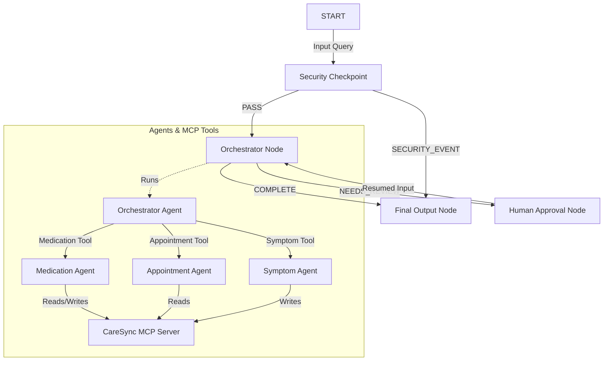

# CareSync Concierge — Submission Write-Up 🩺

## Problem Statement
Patients managing chronic diseases (such as hypertension, cardiovascular diseases, or diabetes) are burdened with complex care routines. They must coordinate medication dosages, log vital health metrics (like blood pressure or blood sugar), track symptoms, and manage multiple clinical appointments. 

Traditional health tracking is fragmented, static, and prone to user error or fatigue. Patients need a secure, interactive health concierge that helps them consolidate, query, and manage their daily care routine. However, because health data is highly sensitive, any AI agent operating in this domain must be bounded by strict security checkpoints and require human consent for major actions.

---

## Solution Architecture

---

## Concepts Used & Code References

1.  **ADK 2.0 Workflow**: Built as a stateful directed graph defining deterministic routes. 
    *   *Reference*: `app/agent.py` L236-248 (definition of the `Workflow` class instance).
2.  **LlmAgent**: Used to represent specialist agents with clear instruction domains.
    *   *Reference*: `app/agent.py` L49-75 (instantiation of `medication_agent`, `appointment_agent`, and `symptom_agent`).
3.  **AgentTool**: Used by the orchestrator to delegate natural language tasks to specialists.
    *   *Reference*: `app/agent.py` L92-96 (adding sub-agents wrapped in `AgentTool` to the orchestrator).
4.  **MCP Server**: Implemented a standalone local server using the Python MCP SDK (`FastMCP`) to host database tools.
    *   *Reference*: `app/mcp_server.py` (complete implementation of the tools & server).
5.  **Security Checkpoint**: Implemented regex scrubbers, prompt injection keyword detection, and JSON logging.
    *   *Reference*: `app/agent.py` L107-181 (`security_checkpoint` function node).
6.  **Agents CLI**: Scaffolded, packaged, and managed using the `agents-cli` tool and `uv`.

---

## Security Design

The agent contains a primary **Security Checkpoint** function node that intercepts every incoming request before it reaches any LLM:
*   **PII Scrubbing**: Regex patterns scrub emails, phone numbers, and Medical Record Numbers (MRNs) to protect patient privacy and HIPAA compliance.
*   **Prompt Injection Detection**: Scans inputs for adversarial strings (e.g. "ignore prior instructions") and aborts the execution path immediately, logging a `CRITICAL` severity event.
*   **Structured Audit Logging**: Outputs JSON log events to track user activities and system status, enabling auditing.
*   **Domain Filtering**: Filters out off-topic requests to keep the agent focused purely on health and medical concierge duties.

---

## MCP Server Design

The `mcp_server.py` file exposes 4 domain-specific tools, acting as an abstraction layer over the patient database:
1.  `get_patient_medications(patient_name)`: Reads active medications, dosages, and refill dates.
2.  `update_patient_medication(patient_name, med_name, dosage, frequency)`: Inserts/updates patient medication records.
3.  `get_appointments(patient_name)`: Returns upcoming cardiologist or primary care consultations.
4.  `log_patient_symptom(patient_name, symptom, severity, notes)`: Logs daily patient symptoms.

---

## Human-in-the-Loop (HITL) Flow

A crucial safety requirement in healthcare is human verification before modifying schedules or booking clinical visits.
*   **Trigger**: If the `orchestrator_node` detects clinical appointment booking/cancellation keywords, it outputs the `NEEDS_REVIEW` route.
*   **Interruption**: The `human_approval_node` yields a `RequestInput(interrupt_id="appointment_approval")` event, pausing the workflow graph.
*   **Resolution**: The user must explicitly type `yes`/`approve` in the UI to resume the flow, which sets `human_approval_decision` to `APPROVED` in `ctx.state` and permits the booking.

---

## Demo Walkthrough
*   **Case 1 (Medications)**: User requests to see their medications. Orchestrator calls the Medication Specialist, which uses MCP tool `get_patient_medications` to fetch John Doe's records.
*   **Case 2 (Appointments & HITL)**: User asks to book an appointment. The workflow pauses, prompts for confirmation, and once approved, fetches Dr. Jenkins' card details.
*   **Case 3 (Prompt Injection Block)**: User submits a prompt injection query. The security checkpoint flags it and terminates the execution path immediately without calling Gemini, saving API quota and ensuring safety.

---

## Impact & Value Statement

CareSync Concierge reduces cognitive load for chronic disease patients by acting as a highly reliable, secure, and interactive care planner. By incorporating a dedicated security checkpoint and human-in-the-loop approvals, it establishes a reliable pattern for building production-ready, safety-conscious medical assistant agents.
